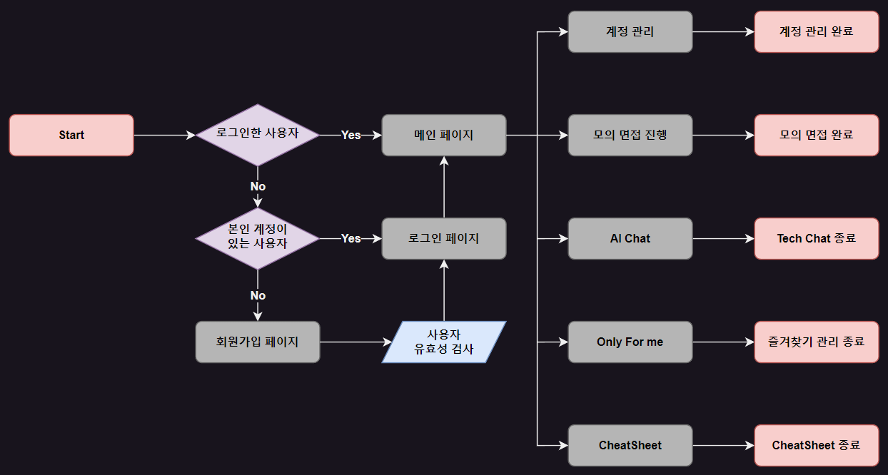

# 개발자 모의 기술 면접 지원 서비스
## 목차
[1. 목표와 기능](#1-목표와-기능)  
[2. 개발 기술 및 환경, 개발 일정 및 배포 URL](#2-개발-기술-및-환경-개발-일정-및-배포-url)  
[3. 요구사항 및 기능 명세](#3-요구사항-및-기능-명세)  
[4. 화면 설계(Wireframe)](#4-화면-설계wireframe)  
[5. 데이터베이스 모델링(ER Diagram)](#5-데이터베이스-모델링er-diagram)  
[6. API 명세서](#6-api-명세서)  
[7. 프로젝트 구조](#7-프로젝트-구조)  
[8. 메인 기능](#8-메인-기능)  
[9. 부가 기능](#9-부가-기능)  
[10. 개발 이슈](#10-개발-이슈)  
[11. 개발 회고](#11-개발-회고)

## 1. 목표와 기능
### 1-1. 목표
- 개발자 준비 과정에서 필요한 기술 모의 면접에 관련된 전반의 준비를 지원하는 플랫폼

### 1-2. 기능
- ChatGPT API를 통한 각 분야별, 경력별 기술 면접 기능
- 모의 면접 진행이 가능하며 해당 질문의 의도나 질문에 대한 모범 답을 확인하는 기능
- 기술 면접과 관련된 질문을 받아 답변을 해주는 챗봇 기능

#### [Flow Chart]


## 2. 개발 기술 및 환경, 개발 일정 및 배포 URL
### 2-1. 개발 기술
#### [기술 - FE]  
<div>
    
    
    
    
</div>

#### [기술 - BE]
<div>
    
    
</div>

#### [기술 - DB]


### 2-2. 개발 환경
<div>
    
    
    
</div>

### 2-4. 개발 일정
추가 필요

### 2-4. 배포 URL
추가 필요

## 3. 요구사항 및 기능 명세


## 4. 화면 설계(Wireframe)
- [와이어프레임 테스트 페이지](https://ovenapp.io/view/C3LmQ9sGvyqM28Cg9ZejPeTYKSOK1O5K/5IAOQ)  
 

|||||
|-|-|-|-|
|메인 페이지 로그인 전|로그인 페이지|회원가입 페이지|메인 페이지 로그인 후|
|모의 면접 페이지 1|모의 면접 페이지2|모의 면접 페이지 3|모의 면접 페이지4|
|모의 면접 페이지 5|모의 면접 페이지6|모의 면접 페이지 7|모의 면접 페이지8|
|Tech Chatbot 페이지|치트 시트 페이지 1|치트 시트 페이지 2|Only For Me(즐겨찾기) 페이지|

## 5. 데이터베이스 모델링(ER Diagram)
  

## 6. API 명세서
|app:accounts|HTTP Method|설명|로그인 권한 필요|작성자 권한 필요|
|:-|:-|:-|:-:|:-:|
|signup/|POST|회원가입|||
|login/|POST|로그인|||
|logout/|POST|로그아웃|✅||
|\<int:pk\>/|GET|프로필 조회|✅||
|\<int:pk\>/|PUT|프로필 수정|✅|✅|
|\<int:pk\>/|DELETE|회원 탈퇴|✅|✅|
<br>  

|app:interview|HTTP Method|설명|로그인 권한 필요|작성자 권한 필요|
|:-|:-|:-|:-:|:-:|
|question/|POST|문제 요청|✅||
|grading/|POST|단위 문제 채점|✅||
|total_grading/|POST|모의 면접 전체 채점|✅||
|favorite/|POST|즐겨찾기 추가|✅||
|favorite/\<int:pk\>/|DELETE|즐겨찾기 삭제|✅|✅|
<br>

|app:chatbot|HTTP Method|설명|로그인 권한 필요|작성자 권한 필요|
|:-|:-|:-|:-:|:-:|
|/|POST|채팅방 생성|✅||
|/list/|GET|채팅방 리스트|✅|✅|
|/\<int:pk\>/messages/|POST|이전 채팅 내용 요청|✅|✅|
|/\<int:pk\>/|DELETE|채팅방 삭제|✅|✅|
|/answer/|POST|답변 요청|✅|✅|

## 7. 프로젝트 구조
추가 필요

## 8. 메인 기능
추가 필요

## 9. 부가 기능
추가 필요

## 10. 개발 이슈
### 10-1. 회원가입 시 사용자 Serializers에서 Data를 User 모델에 삽입 시 오류
#### 10-1-1. 문제 원인
```python
class UserSerializer(ModelSerializer):
    '''
    사용자 Serializer
    '''
    password2 = serializers.CharField(style={'input_type': 'password'}, write_only=True)
    class Meta:
        model = User
        fields = ['email', 'username', 'password', 'password2']
        extra_kwargs = {
            'password':{'write_only': True}
        }

    def create(self, validated_data):
        '''
        사용자 유효성 검사 후 사용자 생성하는 함수
        '''
        password = validated_data.pop('password')
        user = User(**validated_data)
        user.set_password(password)
        user.save()
        return user
```
- 해당 문제는 위의 코드에서 발생하였고, 문제의 원인은 비밀번호 확인 유효성 검사를 위해 기존의 User 모델에 존재하지 않는 password2를 fields에 추가해두어서 해당 데이터가 User 모델에 같이 삽입되면서 발생한 오류였습니다.
#### 10-1-2. 해결 방법
```python
    def create(self, validated_data):
        '''
        사용자 유효성 검사 후 사용자 생성하는 함수
        '''
        password = validated_data.pop('password')
        user = User(
            email=validated_data.pop('email'),
            username=validated_data.pop('username'))
        user.set_password(password)
        user.save()
        return user
```
- 해당 문제는 create 함수 코드 중 user를 생성하는 코드를 validated_data를 한꺼번에 집어넣는 것이 아닌 필드별로 값을 주어 user를 생성하는 방법으로 코드를 수정하여 해결하였습니다.
### 10-2. 채팅방 생성 테스트 시 원인 불명의 400에러가 발생
#### 10-2-1. 문제 원인
```shell
======================================================================
FAIL: test_chatbot_create (chatbot.tests.TestChatbot.test_chatbot_create)
챗봇 생성 테스트
----------------------------------------------------------------------
Traceback (most recent call last):
  File "D:\mockinterview\mock_interview_BE\chatbot\tests.py", line 33, in test_chatbot_create
    self.assertEqual(response.status_code, 201)
AssertionError: 400 != 201

----------------------------------------------------------------------
```
- 해당 문제는 로그인한 사용자만 접근이 가능하도록 개발한 채팅방 생성 기능을 테스트하는 중 발생한 문제입니다.
- 문제의 원인은 ChatRoom 모델 생성 시 외래키로 설정해두었던 사용자 모델을 위한 데이터 값을 요청 시 함께 보내지 않은 것이었습니다.
#### 10-2-2. 해결 방법
- 문제 해결을 위해서 아래 코드와 같이 데이터 값에 사용자의 pk값을 넘김으로 문제를 해결할 수 있었습니다.
```python
# 수정 전 코드
response = self.client.post(
    '/chatbot/', 
    HTTP_AUTHORIZATION=f'Bearer {self.access_token}', 
    format='json')

# 수정 후 코드
response = self.client.post(
    '/chatbot/', 
    data={'client':1},
    HTTP_AUTHORIZATION=f'Bearer {self.access_token}', 
    format='json')
```
- 이 문제를 해결하며 DRF에서 외래키로 설정하게 되면 데이터를 입력받을 때 대상 외래키 테이블의 pk 값을 넘겨주게 되면 데이터 저장 시 자동으로 해당 pk의 대상 인스턴스 값을 저장한다는 사실을 알 수 있었습니다.

## 11. 개발 회고
추가 필요