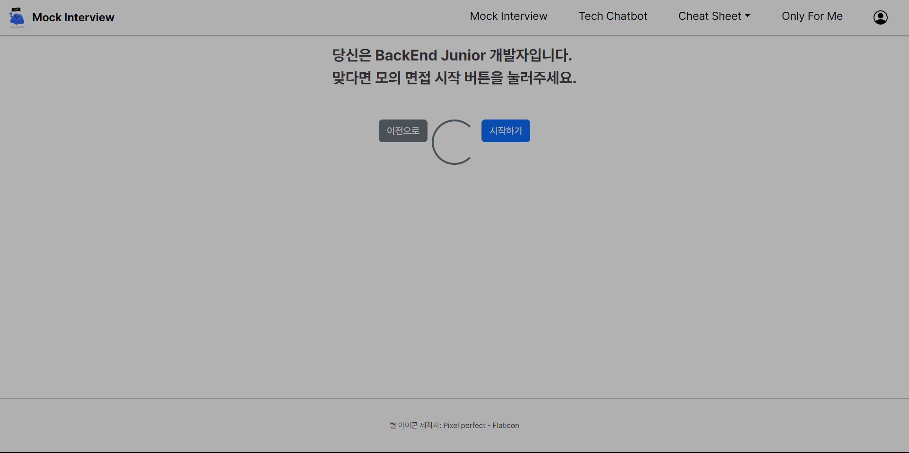
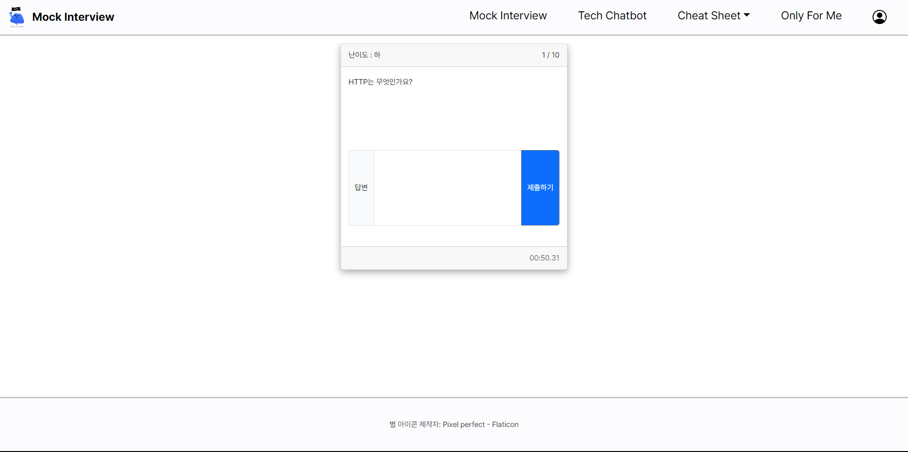
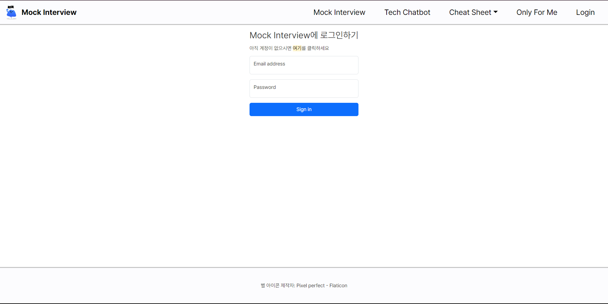

# 개발자 모의 기술 면접 지원 서비스
## 목차
[1. 목표와 기능](#1-목표와-기능)  
[2. 개발 기술 및 환경, 개발 일정](#2-개발-기술-및-환경-개발-일정)  
[3. 배포 URL 및 아키텍쳐](#3-배포-url-및-아키텍쳐)  
[4. 요구사항 및 기능 명세](#4-요구사항-및-기능-명세)  
[5. 화면 설계(Wireframe)](#5-화면-설계wireframe)  
[6. 데이터베이스 모델링(ER Diagram)](#6-데이터베이스-모델링er-diagram)  
[7. API 명세서](#7-api-명세서)  
[8. 프로젝트 구조](#8-프로젝트-구조)  
[9. UI](#9-ui)  
[10. 메인 기능](#10-메인-기능)  
[11. 부가 기능](#11-부가-기능)  
[12. 개발 이슈](#12-개발-이슈)  
[13. 개발 회고](#13-개발-회고)

## 1. 목표와 기능
### 1-1. 목표
- 개발자 준비 과정에서 필요한 기술 모의 면접에 관련된 전반의 준비를 지원하는 플랫폼

### 1-2. 기능
- ChatGPT API를 통한 각 분야별, 경력별 기술 면접 기능
- 모의 면접 진행이 가능하며 해당 질문의 의도나 질문에 대한 모범 답을 확인하는 기능
- 기술 면접과 관련된 질문을 받아 답변을 해주는 챗봇 기능

#### [Flow Chart]


## 2. 개발 기술 및 환경, 개발 일정 
### 2-1. 개발 기술
#### [기술 - FE]  
<div>
    
    
    
    
</div>

#### [기술 - BE]
<div>
    
    
</div>

#### [기술 - DB]


### 2-2. 개발 환경
<div>
    
    
    
    
</div>

### 2-3. 개발 일정


## 3. 배포 URL 및 아키텍쳐
### 3-1. 배포 URL
#### [Django(API) 서버]  
https://mockinterview.shop/ (배포 서버 중단)  

#### [클라이언트(FrontEnd) 서버]  
http://mockinterview-bucket.s3-website.ap-northeast-2.amazonaws.com/ (배포 서버 중단)
```
배포 테스트 계정
ID : test@test.com
PW : test123!@#
```

### 3-2. 배포 아키텍쳐


## 4. 요구사항 및 기능 명세


## 5. 화면 설계(Wireframe)
- [와이어프레임 테스트 페이지](https://ovenapp.io/view/C3LmQ9sGvyqM28Cg9ZejPeTYKSOK1O5K/5IAOQ)  
 

<div style="display:flex; justify-content:space-between; margin-bottom:1rem;">
    
    
</div>
<div style="display:flex; justify-content:space-between; margin-bottom:1rem;">
    
    
</div>
<div style="display:flex; justify-content:space-between; margin-bottom:1rem;">
    
    
</div>
<div style="display:flex; justify-content:space-between; margin-bottom:1rem;">
    
    
</div>
<div style="display:flex; justify-content:space-between; margin-bottom:1rem;">
    
    
</div>
<div style="display:flex; justify-content:space-between; margin-bottom:1rem;">
    
    
</div>
<div style="display:flex; justify-content:space-between; margin-bottom:1rem;">
    
    
</div>
<div style="display:flex; justify-content:space-between; margin-bottom:1rem;">
    
    
</div>

## 6. 데이터베이스 모델링(ER Diagram)
  

## 7. API 명세서
|app:accounts|HTTP Method|설명|로그인 권한 필요|작성자 권한 필요|
|:-|:-|:-|:-:|:-:|
|signup/|POST|회원가입|||
|login/|POST|로그인|||
|logout/|POST|로그아웃|✅||
|\<int:pk\>/|GET|프로필 조회|✅||
|\<int:pk\>/|PUT|프로필 수정|✅|✅|
|\<int:pk\>/|DELETE|회원 탈퇴|✅|✅|
|status/|GET|로그인 상태 확인|||
|token/refresh/|POST|만료 토큰 재발급|||
<br>  

|app:interview|HTTP Method|설명|로그인 권한 필요|작성자 권한 필요|
|:-|:-|:-|:-:|:-:|
|question/|POST|문제 요청|✅||
|grading/|POST|단위 문제 채점|✅||
|total_grading/|POST|모의 면접 전체 채점|✅||
|favorite/|POST|즐겨찾기 추가|✅||
|favorite/\<int:pk\>/|DELETE|즐겨찾기 삭제|✅|✅|
|field_question/|POST|분야별 예상 문제 요청|✅||
<br>

|app:chatbot|HTTP Method|설명|로그인 권한 필요|작성자 권한 필요|
|:-|:-|:-|:-:|:-:|
||POST|채팅방 생성|✅||
|list/|GET|채팅방 리스트|✅|✅|
|\<int:pk\>/messages/|GET|이전 채팅 내용 요청|✅|✅|
|\<int:pk\>/|DELETE|채팅방 삭제|✅|✅|
|answer/|POST|답변 요청|✅|✅|

## 8. 프로젝트 구조
### 8-1. BE 프로젝트 구조
```
📦mock_interview_BE
 ┣ 📂.config
 ┃ ┣ 📂nginx
 ┃ ┃ ┗ 📜mock_interview.conf
 ┃ ┗ 📂uwsgi
 ┃ ┃ ┣ 📜mock_interview.ini
 ┃ ┃ ┗ 📜uwsgi.service
 ┣ 📂.git
 ┣ 📂account
 ┃ ┣ 📜managers.py
 ┃ ┣ 📜models.py
 ┃ ┣ 📜serializers.py
 ┃ ┣ 📜tests.py
 ┃ ┣ 📜urls.py
 ┃ ┣ 📜validators.py
 ┃ ┣ 📜views.py
 ┣ 📂chatbot
 ┃ ┣ 📜models.py
 ┃ ┣ 📜permissions.py
 ┃ ┣ 📜serializers.py
 ┃ ┣ 📜tests.py
 ┃ ┣ 📜throttles.py
 ┃ ┣ 📜urls.py
 ┃ ┣ 📜utils.py
 ┃ ┣ 📜views.py
 ┣ 📂interview
 ┃ ┣ 📜models.py
 ┃ ┣ 📜serializers.py
 ┃ ┣ 📜tests.py
 ┃ ┣ 📜throttles.py
 ┃ ┣ 📜urls.py
 ┃ ┣ 📜utils.py
 ┃ ┣ 📜views.py
 ┣ 📂mock_interview
 ┃ ┣ 📜settings.py
 ┃ ┣ 📜urls.py
 ┣ 📂static
 ┣ 📜.gitignore
 ┣ 📜db.sqlite3
 ┣ 📜manage.py
 ┣ 📜README.md
 ┗ 📜requirements.txt
```
### 8-2. FE 프로젝트 구조
```
📦mock_interview_FE
 ┣ 📂.git
 ┣ 📂assets
 ┃ ┣ 📂dist
 ┃ ┃ ┣ 📂css
 ┃ ┃ ┣ 📂fonts
 ┃ ┃ ┣ 📂images
 ┃ ┃ ┗ 📂js
 ┃ ┃ ┃ ┣ 📜account.js
 ┃ ┃ ┃ ┣ 📜chatbot.js
 ┃ ┃ ┃ ┣ 📜cheatsheet.js
 ┃ ┃ ┃ ┣ 📜interview.js
 ┃ ┃ ┃ ┣ 📜onlyforme.js
 ┃ ┃ ┃ ┗ 📜page.js
 ┃ ┣ 📂images
 ┃ ┣ 📂js
 ┃ ┗ 📂video
 ┗ 📜index.html
```

## 9. UI
<div style="display:flex; justify-content:space-between; margin-bottom:1rem;">
    
    
</div>
<div style="display:flex; justify-content:space-between; margin-bottom:1rem;">
    
    
</div>
<div style="display:flex; justify-content:space-between; margin-bottom:1rem;">
    
    
</div>
<div style="display:flex; justify-content:space-between; margin-bottom:1rem;">
    
    
</div>
<div style="display:flex; justify-content:space-between; margin-bottom:1rem;">
    
    
</div>
<div style="display:flex; justify-content:space-between; margin-bottom:1rem;">
    
    
</div>
<div style="display:flex; justify-content:space-between; margin-bottom:1rem;">
    
    
</div>
<div style="display:flex; justify-content:space-between; margin-bottom:1rem;">
    
</div>

## 10. 메인 기능
### 10-1. 모의 면접 기능  
<br/>
- authentication_classes, permission_classes를 기반으로 로그인한 회원에게만 제공하는 기능으로 본인의 개발 분야, 경력을 선택하여 GPT가 추천하는 질문으로 모의 기술 면접을 진행할 수 있는 기능입니다.
- 해당 기능을 사용할 수 있는지의 권한은 JWT 기술을 사용한 토큰 기반 인증 방식으로 판단되고, 이 토큰은 로그인시 API 서버에서 전송되어 로컬 스트로지에 Refresh, Access 토큰으로 구분되어 저장됩니다.
- 해당 기능은 API 서버에 요청하여 ChapGPT에 개발된 코드로 요청을 통해 응답받은 값을 화면에 출력하여 기능을 제공합니다.
- 이 기능은 Throttle을 사용하여 면접 CheatSheet 기능과 함께 한 계정 당 하루 5번의 요청 제한을 하고 있습니다.

### 10-2. 기술 면접 챗봇 기능
<br/>
- authentication_classes, permission_classes를 기반으로 로그인한 회원에게만 제공하는 기능으로 기술 면접과 관련하여 챗봇을 통해 응답받을 수 있는 기능 입니다.
- 질문한 내용과 응답받은 내용은 DB에 저장되어서 이후 다시 접속하여 기능 사용 시 이전 질문을 기반으로 ChatGPT의 응답을 얻어낼 수 있습니다.
- 해당 기능을 사용할 수 있는지의 권한은 JWT 기술을 사용한 토큰 기반 인증 방식으로 판단되고, 이 토큰은 로그인시 API 서버에서 전송되어 로컬 스트로지에 Refresh, Access 토큰으로 구분되어 저장됩니다. 추가로 API 서버의 permission 코드를 통해 해당 데이터에 대한 작성자만이 데이터 관리를 할 수 있도록 권한을 제한하는 기능을 제공합니다.
- 이전 질문이 저장됨으로인해서 이후 질문에 영향을 주기 때문에 챗봇을 사용할 수 있는 채팅방을 관리하는 DB를 통해 여러개의 채팅방을 생성하여 사용자의 질문 내용에 맞는 답변을 받을 수 있도록 구현하였습니다.
- 해당 기능은 API 서버에서 ChatGPT Openai를 통해 요청하여 응답한 값을 통해 사용자의 질문에 응답합니다.
- 이 기능은 Throttle을 사용하여 한 계정 당 하루 5번의 요청 제한을 하고 있습니다.


### 10-3. 면접 CheatSheet 기능
<br/>
- authentication_classes, permission_classes를 기반으로 로그인한 회원에게만 제공하는 기능으로 BE, FE 분야별 기술 면접과 관련하여 예상 질문을 제공받을 수 있는 기능입니다.
- 해당 기능을 사용할 수 있는지의 권한은 JWT 기술을 사용한 토큰 기반 인증 방식으로 판단되고, 이 토큰은 로그인시 API 서버에서 전송되어 로컬 스트로지에 Refresh, Access 토큰으로 구분되어 저장됩니다.
- 해당 기능은 사용자에게 질문, 의도, 난이도, 모범 답안을 제공하여 기술 면접에 대비에 도움을 줍니다.
- 이 기능은 Throttle을 사용하여 면접 모의 면접 기능과 함께 한 계정 당 하루 5번의 요청 제한을 하고 있습니다.

## 11. 부가 기능
### 11-1. 즐겨찾기 기능
<br/>
- authentication_classes, permission_classes를 기반으로 로그인한 회원에게만 제공하는 기능으로 모의 면접과 CheatSheet 기능을 통해 즐겨찾기에 추가된 즐겨찾기 목록을 통해 복습 및 목록 관리를 제공하는 기능입니다.
- 해당 기능을 사용할 수 있는지의 권한은 JWT 기술을 사용한 토큰 기반 인증 방식으로 판단되고, 이 토큰은 로그인시 API 서버에서 전송되어 로컬 스트로지에 Refresh, Access 토큰으로 구분되어 저장됩니다. 기능 중 즐겨찾기 삭제 기능은 API 서버의 permission 코드를 통해 해당 데이터에 대한 작성자만이 데이터 관리를 할 수 있도록 권한을 제한하는 기능을 제공합니다.
- 해당 기능은 DB를 통해 사용자 계정별로 관리되는 기능으로 사용자가 재접속되어도 데이터는 지속적으로 관리됩니다.

### 11-2. 사용자 계정 기능
<br/>
- 계정과 관련된 생성, 조회, 수정, 삭제, 로그인, 로그아웃을 일괄 제공하고 계정 기능입니다.
- 커스텀 유저를 이용해 생성된 유저 모델로 이메일을 사용해 로그인 기능을 제공합니다.
- 로그인한 계정을 기반으로 여러 기능을 제공받을 수 있습니다.


## 12. 개발 이슈
### 12-1. 회원가입 시 사용자 Serializers에서 Data를 User 모델에 삽입 시 오류
#### 12-1-1. 문제 원인
```python
class UserSerializer(ModelSerializer):
    '''
    사용자 Serializer
    '''
    password2 = serializers.CharField(style={'input_type': 'password'}, write_only=True)
    class Meta:
        model = User
        fields = ['email', 'username', 'password', 'password2']
        extra_kwargs = {
            'password':{'write_only': True}
        }

    def create(self, validated_data):
        '''
        사용자 유효성 검사 후 사용자 생성하는 함수
        '''
        password = validated_data.pop('password')
        user = User(**validated_data)
        user.set_password(password)
        user.save()
        return user
```
- 해당 문제는 위의 코드에서 발생하였고, 문제의 원인은 비밀번호 확인 유효성 검사를 위해 기존의 User 모델에 존재하지 않는 password2를 fields에 추가해두어서 해당 데이터가 User 모델에 같이 삽입되면서 발생한 오류였습니다.
#### 12-1-2. 해결 방법
```python
    def create(self, validated_data):
        '''
        사용자 유효성 검사 후 사용자 생성하는 함수
        '''
        password = validated_data.pop('password')
        user = User(
            email=validated_data.pop('email'),
            username=validated_data.pop('username'))
        user.set_password(password)
        user.save()
        return user
```
- 해당 문제는 create 함수 코드 중 user를 생성하는 코드를 validated_data를 한꺼번에 집어넣는 것이 아닌 필드별로 값을 주어 user를 생성하는 방법으로 코드를 수정하여 해결하였습니다.
### 12-2. 채팅방 생성 테스트 시 원인 불명의 400에러가 발생
#### 12-2-1. 문제 원인
```shell
======================================================================
FAIL: test_chatbot_create (chatbot.tests.TestChatbot.test_chatbot_create)
챗봇 생성 테스트
----------------------------------------------------------------------
Traceback (most recent call last):
  File "D:\mockinterview\mock_interview_BE\chatbot\tests.py", line 33, in test_chatbot_create
    self.assertEqual(response.status_code, 201)
AssertionError: 400 != 201

----------------------------------------------------------------------
```
- 해당 문제는 로그인한 사용자만 접근이 가능하도록 개발한 채팅방 생성 기능을 테스트하는 중 발생한 문제입니다.
- 문제의 원인은 ChatRoom 모델 생성 시 외래키로 설정해두었던 사용자 모델을 위한 데이터 값을 요청 시 함께 보내지 않은 것이었습니다.
#### 12-2-2. 해결 방법
- 문제 해결을 위해서 아래 코드와 같이 데이터 값에 사용자의 pk값을 넘김으로 문제를 해결할 수 있었습니다.
```python
# 수정 전 코드
response = self.client.post(
    '/chatbot/', 
    HTTP_AUTHORIZATION=f'Bearer {self.access_token}', 
    format='json')

# 수정 후 코드
response = self.client.post(
    '/chatbot/', 
    data={'client':1},
    HTTP_AUTHORIZATION=f'Bearer {self.access_token}', 
    format='json')
```
- 이 문제를 해결하며 DRF에서 외래키로 설정하게 되면 데이터를 입력받을 때 대상 외래키 테이블의 pk 값을 넘겨주게 되면 데이터 저장 시 자동으로 해당 pk의 대상 인스턴스 값을 저장한다는 사실을 알 수 있었습니다.

### 12-3. 클라이언트에서 서버로 요청 시 브라우저가 새로고침되는 현상
#### 12-3-1. 문제 원인
- 이 문제는 비동기 개발을 위해서 페이지의 이동이나 새로고침이 없어야되는 상황에서 발생한 문제입니다. 서버로 요청을 보내 응답을 받게 되면 계속해서 브라우저에서 새로고침이 발생하다보니 비동기로 개발된 코드가 의미가 없는 상황이었고, 문제의 원인을 확인하기 위해서 서버, ajax 코드 등을 확인했지만 해결할 수 없었습니다.
- 답은 vscode에서 개발 시 사용하고 있는 liveserver의 auto reload 기능에 있었습니다. live server는 로컬에 json 파일을 두어 해당 파일에 데이터를 저장하는 방식인데, 데이터의 변동이 생기게 되면 자동으로 새로고침이 되어 그 영향을 받아 문제가 발생했던 것이었습니다.
#### 12-3-2. 해결 방법
- 문제 해결을 위해 live server extension의 설정을 아래와 같이 변경해주었고, 문제를 해결할 수 있었습니다.
```json
{
    ...
    "liveServer.settings.ignoreFiles":["**"],
}
```

### 12-4. API 서버 배포 시 IP 주소는 정상 접속되지만 도메인 주소로 접속되지 않는 현상
#### 12-4-1. 문제 원인
- 문제 상황은 이전에 배포된 IP 주소는 정상 접속되는 반면 새로 구매하여 연결한 도메인 주소는 'DNS_PROBE_FINISHED_NXDOMAIN'라는 응답을 전송하며 정상 접속이 되지 않는 상황이었습니다. 문제의 원인을 확인하는 과정에서 DNS 설정의 원인이나 도메인 등록 중 도메인의 정상 활성화가 되지 않는 원인들을 확인해보았지만 정상적으로 설정 및 활성화가 되어 있었고, 이 문제의 원인은 프로퍼게이션 시간이라는 것을 확인할 수 있었습니다.
- 프로퍼게이션 시간이란 DNS 설정이 변경된 경우 전 세계 DNS 서버에 변경 사항이 적용되기 까지의 시간을 말하는 것으로 몇 분에서 길게는 이틀까지 소요될 수 있는 시간을 말합니다.
#### 12-4-2. 해결 방법
- 이 문제의 해결은 시간에 있었습니다. 문제의 원인이 프로퍼게이션 시간이었기 때문에 정상 설정한 이후 30분 정도의 시간 이후 정상 접속되는 것을 확인할 수 있었습니다.

## 13. 개발 회고
### 13-1. TDD 기반 개발
```text
 이번 프로젝트는 모든 기능을 개발하는데 있어서 테스트 주도 개발을 하려 노력했던 프로젝트였습니다.
 이를 위해서 모든 기능을 개발할 때 테스트 코드를 작성하는 것을 시작점으로 두었고, 개발이 완료된 코드들이 테스트 코드를 통과하는지까지 확인하며 기능 단위별 개발을 진행하였습니다.

 처음 테스트 코드를 1~2개 작성하며 기능을 개발할 때 당장의 테스트 코드 작성이 프로젝트에 긍정적 영향이 있을까라는 의문이 들기도 했지만, 그 의문은 프로젝트 중반을 넘어가면서 해소되었습니다.
 한번 작성된 테스트 코드는 프로젝트 진행 과정 중 언제라도 프로젝트의 새로운 기능 개발에 사이드 이펙트는 없는지 새로 발생한 오류는 없는지를 체크해주는 기반을 마련해주었습니다.

 이뿐만 아니라 백엔드 서버와 프론트엔드 서버를 모두 개발해야 하는 이번 프로젝트의 경우 개발자의 입장에서는 테스트 코드가 하나의 API 명세서의 역할을 해주고 있음을 알게 됐습니다.
 실무의 경우 한 개발자가 전부를 개발하는 경우는 드물겠지만, API 명세서를 작성해야하는 백엔드 개발자 입장에서는 테스트 코드가 API 명세서에 기반이 될 수 있음을 깨닫게 되는 경험이었습니다.
```
<br/>

### 13-2. 물리적으로 분리된 서버 배포 경험
```text
 이번 프로젝트는 처음으로 다수의 서버를 배포하여 연동시킨 첫 프로젝트였습니다.
 처음인만큼 배포를 시작할 때 프론트엔드 서버와 백엔드 서버 중 하나라도 배포되면 다행이겠다라는 생각으로 배포를 시작했습니다.

 먼저 API(백엔드) 서버 배포는 처음 Lightsail로 배포를 진행하던 중 로드밸런싱 설정에 비용 문제로 EC2 서버를 사용하게 되었습니다.
 사실 배포가 쉬운 작업이 아니다보니 새로운 환경에 다시 배포를 준비해서 실행한다는 것은 쉬운 결정이 아니었지만, 이번 프로젝트에 가장 큰 의미를 갖는 것 중 하나가 배포이고 배포 중에서도 구입한 도메인과 연결하는 것, HTTP가 아닌 HTTPS로 배포하는 것이라고 생각했기 때문에 포기할 수 없었습니다.
 때문에 포기하지 않고 끈질기게 붙잡고 진행한 결과로 https://mockinterview.shop라는 URL로 배포를 하는 결과물을 얻어낼 수 있었습니다.

 다음으로 클라이언트(프론트) 서버 배포는 S3를 통해 진행했습니다.
 사실 프론트 서버만을 배포했던 경험은 Github Pages뿐이었기 때문에 0부터 시작하는 배포였습니다.
 처음 프론트 엔드 배포의 목표는 HTTPS로 도메인 이름을 갖는 URL로 배포하자 였지만, 실질적으로 할 수 있는 배포를 해야했기 때문에 AWS의 S3를 통해서 웹 사이트를 호스팅하였습니다.

 백엔드 서버와 프론트엔드 서버를 배포하는 과정은 어려움이 많았지만 하나씩 배포되고 결과적으로 배포된 프론트엔드 서버와 백엔드 서버가 통신하여 응답 값이 화면에 출력될 때 지금까지 개발하면서 제일 흥분되는 순간이었고, 개발자로서 한 걸음 더 성장했다고 느꼈습니다.
```